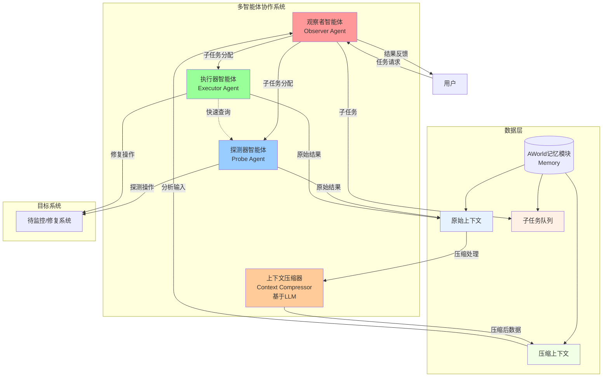
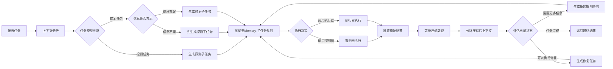
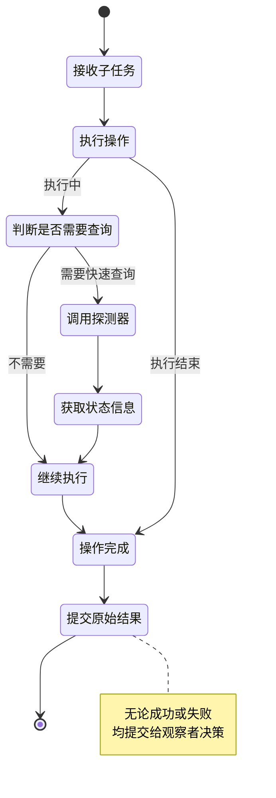
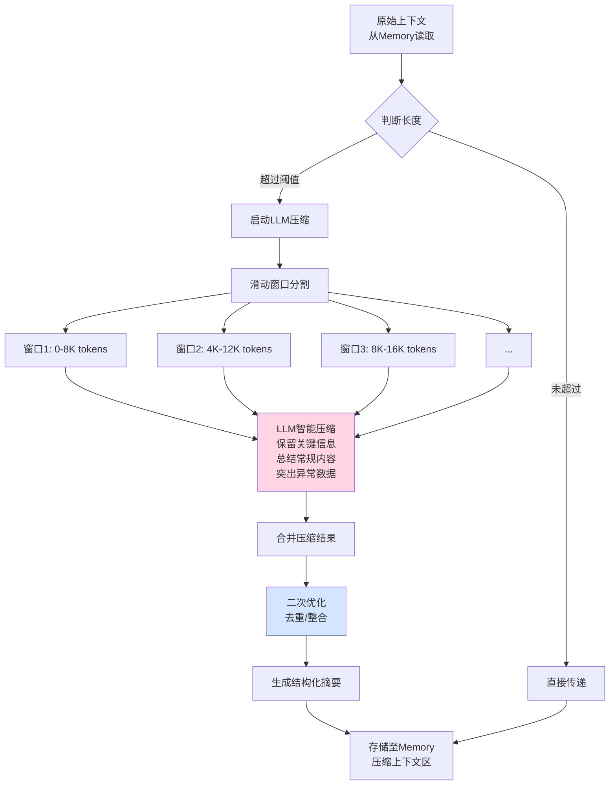
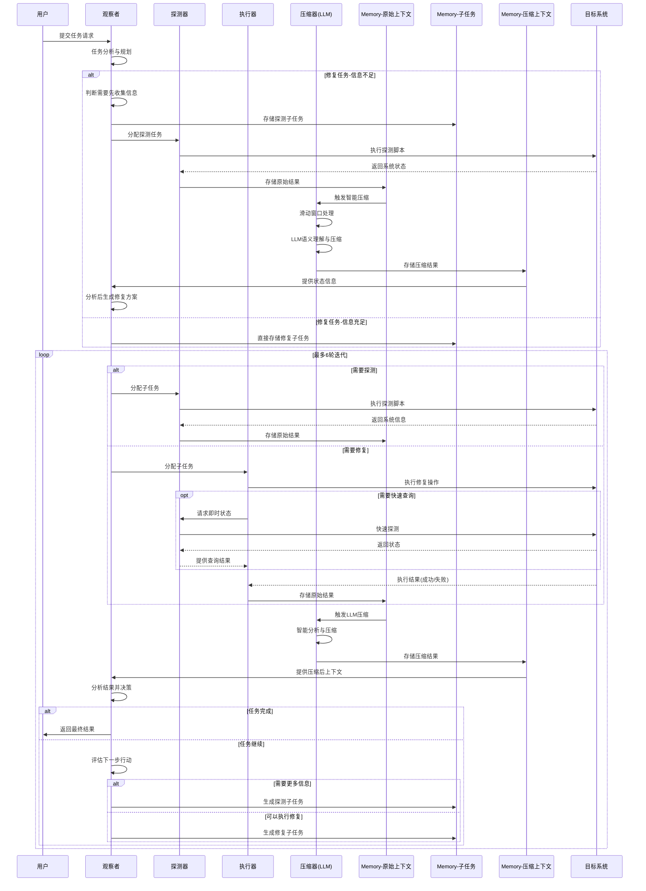
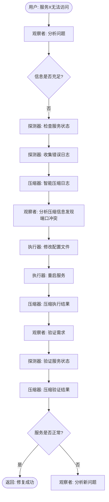
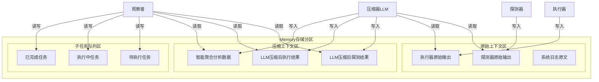

你是一个多智能体专家, 帮我基于下述设计文档完成该智能体协作的通用AI运维平台

 🚀 基于多智能体协作的通用AI运维平台系统设计

## 1. 系统概述

本系统是一个基于多智能体协作的通用AI运维平台，通过**观察者（Observer）**、**探测器（Probe）**和**执行器（Executor）**三个核心智能体的协同工作，配合**上下文压缩器（Context Compressor）**的优化处理，实现对AIOpsLab环境的智能化监控、故障诊断与自动修复。

### 系统架构图



## 2. 核心智能体设计

### 2.1 观察者智能体 (Observer Agent) 🔍

#### **核心职责**

| 职责类别       | 具体描述                                                     |
| -------------- | ------------------------------------------------------------ |
| **上下文分析** | 收集并分析由探测器、执行器产生并经压缩器处理后的系统上下文信息 |
| **任务分解**   | 将复杂故障诊断/修复任务拆分为可执行的原子化子任务，存储于记忆模块 |
| **决策调度**   | 基于分析结果进行智能决策，协调其他智能体的执行顺序和策略     |
| **结果验证**   | 分析执行器和探测器的返回结果，判断任务是否成功完成           |
| **结果输出**   | 根据任务类型（检测/修复）向用户返回格式化的执行结果          |

#### **执行流程**



#### **决策逻辑示例**

```yaml
修复任务决策树:
  初始状态:
    - 条件: 缺少故障详情
    - 决策: 先调用探测器收集系统日志、服务状态
    
  信息收集后:
    - 条件: 已识别故障类型
    - 决策: 生成针对性修复子任务
    
  修复执行后:
    - 条件: 需要验证修复效果
    - 决策: 调用探测器验证系统状态
```

#### **执行特性**

- **执行模式**：单轮决策制（single-round execution）
- **迭代次数**：最多6轮迭代优化
- **决策智能**：基于当前信息动态选择探测或执行
- **错误处理**：支持任务重新规划和回滚决策

### 2.2 探测器智能体 (Probe Agent) 🔎

#### **核心职责**

| 职责类别     | 具体描述                                               |
| ------------ | ------------------------------------------------------ |
| **脚本生成** | 基于观察者分配的子任务，自动生成系统探测脚本           |
| **只读保障** | 严格遵循只读原则，确保探测操作不对系统状态产生任何修改 |
| **信息采集** | 全面收集系统状态、日志、配置等关键信息                 |
| **结果记录** | 将探测原始结果直接存储至Memory的原始上下文区           |

#### **安全约束**

```yaml
探测器安全规则:
  - 禁止执行: [DELETE, UPDATE, INSERT, DROP, ALTER, TRUNCATE]
  - 允许执行: [SELECT, SHOW, DESCRIBE, GET, LIST, READ]
  - 文件操作: 仅限只读模式 (r, rb)
  - 网络操作: 仅限查询类请求 (GET, HEAD, OPTIONS)
```

#### **执行特性**

- **最大轮次**：5轮查询操作
- **错误处理**：自动修正查询语法错误
- **数据存储**：原始结果直接存储，不做预处理

### 2.3 执行器智能体 (Executor Agent) ⚙️

#### **核心职责**

| 职责类别     | 具体描述                                             |
| ------------ | ---------------------------------------------------- |
| **任务执行** | 直接执行观察者分配的原子化子任务，无需分析任务复杂度 |
| **状态修改** | 主动改变系统状态以完成修复任务                       |
| **快速查询** | 必要时调用探测器获取即时系统状态信息                 |
| **结果提交** | 无论成功失败，均将原始执行结果提交至Memory           |

#### **简化执行流程**



#### **执行特性**

- **最大轮次**：3轮操作（包含探测器调用）
- **错误处理**：仅对命令语法错误进行修正
- **结果处理**：不做验证，原始结果直接提交
- **协作模式**：仅在需要即时信息时调用探测器

### 2.4 上下文压缩器 (Context Compressor) 📦

#### **核心特性**

| 特性         | 描述                                        |
| ------------ | ------------------------------------------- |
| **基于LLM**  | 压缩器本身是一个专门训练/提示优化的语言模型 |
| **智能理解** | 自动理解上下文语义，识别关键信息            |
| **动态压缩** | 根据内容重要性动态调整压缩策略              |
| **保真压缩** | 确保关键故障信息和异常数据不丢失            |

#### **压缩处理流程**



#### **滑动窗口机制**

```yaml
滑动窗口配置:
  窗口大小: 8K tokens
  重叠大小: 4K tokens  # 50%重叠确保上下文连续性
  
压缩策略:
  - 关键信息识别:
      - 错误信息: 100%保留
      - 异常日志: 90%保留
      - 状态变化: 80%保留
      - 正常日志: 20%保留（仅保留摘要）
      
  - 智能总结:
      - 重复模式识别并合并
      - 时间序列数据聚合
      - 相似错误归类
      
  - 结构化输出:
      - 问题摘要
      - 关键时间点
      - 异常指标
      - 推荐关注点
```

#### **LLM压缩提示词示例**

```markdown
你是一个专业的日志压缩助手。请对以下运维日志进行智能压缩：

压缩原则：
1. 保留所有错误信息和异常堆栈
2. 总结正常运行日志为简短描述
3. 识别并保留关键状态变化
4. 合并重复出现的相似信息
5. 保持时间线的完整性

输出格式：
- 异常摘要：[关键问题列表]
- 时间线：[重要事件时序]
- 详细异常：[完整错误信息]
- 系统状态：[当前状态总结]
- 数据统计：[量化指标]
```

## 3. 系统工作流程

### 3.1 标准执行流程



### 3.2 典型场景流程示例

#### **场景1：服务故障修复**



### 3.3 记忆管理机制

#### **三层数据存储架构**



#### **数据类型详细说明**

| 数据类型       | 存储位置      | 数据特征             | 访问权限                           | 生命周期       |
| -------------- | ------------- | -------------------- | ---------------------------------- | -------------- |
| **原始上下文** | Memory-原始区 | 未处理的系统返回结果 | 探测器/执行器(写)<br/>压缩器(读)   | 24小时         |
| **子任务**     | Memory-任务区 | 结构化的执行指令     | 观察者(读写)<br/>探测器/执行器(读) | 任务完成后归档 |
| **压缩上下文** | Memory-压缩区 | LLM智能压缩后的数据  | 观察者(读)<br/>压缩器(写)          | 7天            |

### 3.4 回滚机制

#### **触发条件**

| 触发主体   | 触发场景                       | 回滚策略             |
| ---------- | ------------------------------ | -------------------- |
| **观察者** | 分析执行结果后发现系统状态恶化 | 全局状态回滚至检查点 |
| **执行器** | 系统完全崩溃无法继续操作       | 触发紧急回滚         |
| **探测器** | 检测到系统关键服务不可用       | 通知观察者决策回滚   |

## 4. 系统设计原则

### 4.1 通用性原则 🌍

- ✅ **无硬编码**：压缩器基于LLM，无需硬编码压缩规则
- ✅ **可扩展性**：支持新智能体的动态接入
- ✅ **环境适配**：自动适应不同的运维环境和故障类型
- ✅ **提示词优化**：通过持续的提示词工程提升智能体能力

### 4.2 协作效率原则 🤝

- ✅ **职责分离**：观察者负责决策，执行器纯粹执行，探测器只做查询
- ✅ **灵活调度**：观察者基于实际需求动态选择先探测还是先执行
- ✅ **智能压缩**：LLM压缩器自动理解并优化上下文信息
- ✅ **统一决策**：所有结果验证和下一步决策均由观察者完成

### 4.3 容错恢复原则 🛡️

- ✅ **故障隔离**：单个智能体故障不影响整体系统
- ✅ **结果保全**：无论成功失败，均保存完整执行记录
- ✅ **状态回滚**：支持多级回滚和备选方案
- ✅ **审计追踪**：三层数据存储确保完整的操作追溯

## 

